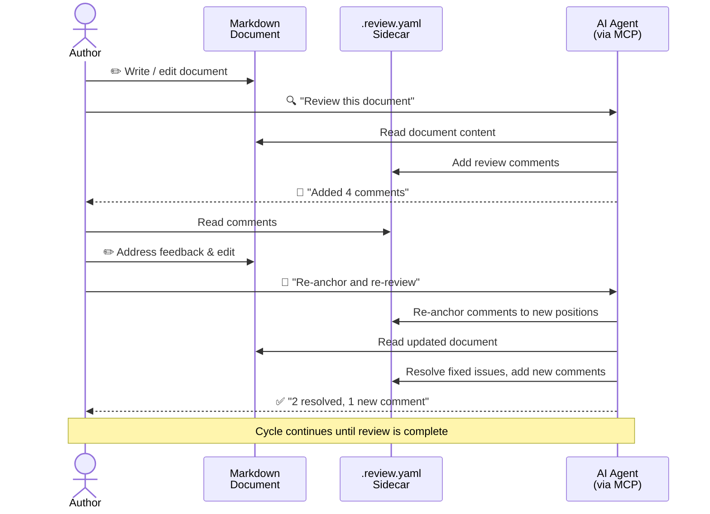

# What is Sidemark / MRSF?

**Markdown Review Sidecar Format (MRSF)**, also known as **Sidemark**, is a portable, version-controlled, and machine-actionable way to store review comments *outside* Markdown files.

## The Problem

Markdown workflows today struggle with durable, context-aware review comments:

- **Inline comments can't move with the text** — edit the document and your annotations break.
- **GitHub / GitLab reviews vanish with edits** — PR review comments are tied to diffs, not the living document.
- **Automated agents have no structured API** — LLMs and bots can't read or write review feedback in a standard way.

## The Solution

MRSF stores review metadata in **sidecar files** (`.review.yaml`) that sit next to the Markdown they annotate:

```
docs/
  architecture.md
  architecture.md.review.yaml   ← sidecar
```

Each sidecar is a simple YAML file:

```yaml
mrsf_version: "1.0"
document: architecture.md
comments:
  - id: abc123
    author: Jane Doe
    timestamp: "2026-03-02T18:22:59Z"
    text: "Can you clarify this section?"
    resolved: false
    line: 9
    selected_text: "The system uses a microservices architecture"
```

## Key Capabilities

### Precise Anchoring

Comments can anchor to a **line**, a **line range**, or an exact **column span** with `selected_text` for durability:

```yaml
line: 12
end_line: 14
start_column: 5
end_column: 42
selected_text: "While many concepts are represented"
```

### Automatic Re-anchoring

When the document is edited, the CLI and MCP server can **re-anchor** comments — finding where the text moved using exact match, fuzzy matching, and git diff analysis.

### Validation

A JSON Schema and CLI validation ensure sidecars are well-formed:

```bash
mrsf validate docs/architecture.md
```

### AI / Agent Integration

The MCP server exposes all operations as tools, so AI assistants can discover, read, and manage reviews:

```json
{
  "mcpServers": {
    "mrsf": { "command": "npx", "args": ["-y", "@mrsf/mcp"] }
  }
}
```

### Agent Skills

The repo includes a ready-to-use [Agent Skill](https://agentskills.io/) for document review. Copy it into your project and any skills-compatible agent can review Markdown files using the MCP server:

```bash
cp -r examples/mrsf-review .agent/skills/
```

See [the skill file](https://github.com/wictorwilen/MRSF/blob/main/examples/mrsf-review/SKILL.md) for details.

## Human + Agent Collaboration

Sidemark enables a seamless review loop between human authors and AI agents — all through portable sidecar files.



Each step is **machine-readable**. The agent never modifies the Markdown directly — it writes structured YAML that humans and tools can inspect, diff, and version-control.

## Next Steps

- [Quick Start](./quick-start) — install and try it in 2 minutes
- [Specification](/specification) — the full MRSF v1.0 spec
- [Examples](./examples) — worked examples for every re-anchoring strategy
- [Python CLI & SDK](./python) — same CLI and library in Python
